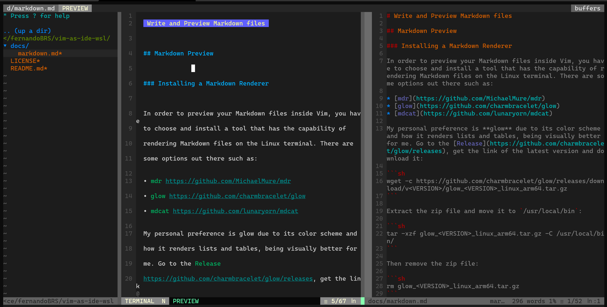

# Write and Preview Markdown files

## Markdown Preview

### Installing a Markdown Renderer

In order to preview your Markdown files inside Vim, you have to choose and install a tool that has the capability of rendering Markdown files on the Linux terminal. There are some options out there such as:

* [mdr](https://github.com/MichaelMure/mdr)
* [glow](https://github.com/charmbracelet/glow)
* [mdcat](https://github.com/lunaryorn/mdcat)

My personal preference is **glow** due to its color scheme and how it renders lists and tables, being visually better for me. Go to the [Release](https://github.com/charmbracelet/glow/releases), get the link of the latest version and download it:

```sh
wget -c https://github.com/charmbracelet/glow/releases/download/v<VERSION>/glow_<VERSION>_linux_arm64.tar.gz
```

Extract the zip file and move it to `/usr/local/bin`:

```sh
tar -xzf glow_<VERSION>_linux_arm64.tar.gz -C /usr/local/bin/
```

Then remove the zip file:

```sh
rm glow_<VERSION>_linux_arm64.tar.gz
```

### Installing a Markdown Preview Plugin

Some plugins out there allows you to preview files on the browser, while others allows you to preview inside Vim. Previewing on the browser has the advantage of rendering more complex code blocks such as diagrams with [mermaid](https://mermaid-js.github.io/mermaid/#/). I have a strong preference of rendering everything inside Vim, and in cases where I have to create mermaid diagrams, I prefer to use Visual Studio Code with the [Markdown Preview](https://marketplace.visualstudio.com/items?itemName=bierner.markdown-mermaid) plugin.

The [preview-markdown.vim](https://github.com/skanehira/preview-markdown.vim) is the plugin that I use to preview files in Vim terminal due the fact that it's easy to configure, as well as it has the flexibility to set its usage along with your preferred Markdown renderer.

Declare the plugin on the `.vimrc` file:

```vim
Plugin 'skanehira/preview-markdown.vim'
```

Then configure the plugin to open the preview window vertically, update the preview window automatically when we write to buffer and target **glow** as the Markdown renderer:

```vim
" ---- Markdown preview setings ----
let g:preview_markdown_vertical = 1
let g:preview_markdown_auto_update = 1
let g:preview_markdown_parser = 'glow'
```

This is how it looks like:


