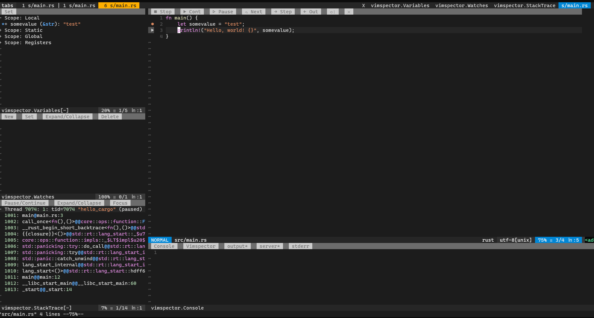

# Add a multi-language graphical debugger

[Vimspector](https://github.com/puremourning/vimspector) is a great multi-language graphical debugger for Vim. It has all the [debugging features](https://github.com/puremourning/vimspector#supported-debugging-features) I need and has a really great [support for many programming languages](https://github.com/puremourning/vimspector#supported-languages). I can configure the use of the same language debuggers I usually used in Visual Studio Code, which is great!

## Configure the plugin on `.vimrc`

Declare the plugin to be installed with Vundle:

```vim
Plugin 'puremourning/vimspector'
```

Configure your preferred set of mappings: [Human](https://github.com/puremourning/vimspector#human-mode) or [Visual Studio/VSCode](https://github.com/puremourning/vimspector#visual-studio--vscode) mode.

```vim
let g:vimspector_enable_mappings = 'VISUAL_STUDIO'
```

Then set your preferred list of [debugger adapters](https://github.com/puremourning/vimspector#supported-languages). Example:


```vim
" Debugging tools in sequence for: Python, Rust.
let g:vimspector_install_gadgets = [ 'debugpy', 'CodeLLDB' ]
```

Then close the `.vimrc` file and install the plugin and the debuggers:

```vim
vim +PluginInstall +qall
```

This is how it looks like:


