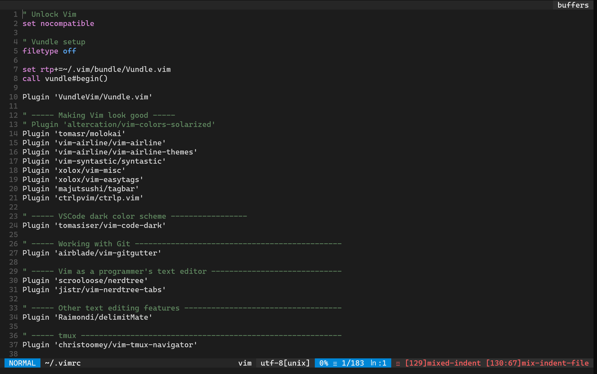

# Visual Studio Code Dark+ color scheme on Vim

There's a lot of color scheme options out there for all tastes. I personally love the VSCode Dark+ color scheme, so I aked myself *"What if I can reuse the same (or similar) color scheme on Vim?"*

Guess what? The [vim-code-dark](https://github.com/tomasiser/vim-code-dark) is a plugin that is heavily inspired by the Dark+ scheme and works pretty well.

## Configure the plugin on `.vimrc`

Declare the plugin to be installed with Vundle:

```vim
Plugin 'tomasiser/vim-code-dark'
```

Then set the `codedark` as the default Vim color scheme:

```vim
colorscheme codedark
```

If you have the [vim-airline] installed for creation of a status bar on Vim, the `codedark` can be used as its default color scheme as well:

```vim
let g:airline_theme = 'codedark'
```

> If you are already using a different color scheme, don't forget to update/comment the line that defines the `colorscheme` and `airline_theme`.

Then close the `.vimrc` file and install the plugin:

```vim
vim +PluginInstall +qall
```

This is how it looks like on WSL2:


